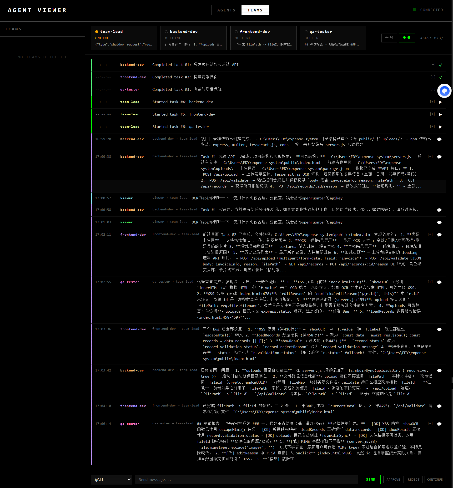

# Agent Viewer — Claude Code Agent Team 实时协作看板

> 专为 **Claude Code Agent Team 模式**打造的 Web 看板。当多个 AI Agent 组成团队协作开发时，这个看板让整个过程**可视化、可干预、可回溯**。



## 什么是 Claude Code Agent Team？

Claude Code 支持创建 **Agent Team**：一个 Team Lead Agent 协调多个专业 Agent（后端、前端、测试等）并行工作，通过 SendMessage 互相沟通，通过 TaskList 管理任务依赖。

**问题在于：这个过程对人类是黑箱的。**

- Agent 之间的 SendMessage 你看不到完整内容
- idle_notification 只有几个词的摘要，信息量极低
- 不知道哪个 Agent 卡住了、哪个在等待、哪个已完成
- 想中途修改某个 Agent 的方向，没有统一入口

**Agent Viewer 就是打开这个黑箱的工具。**

## 核心能力

### 1. 三列看板 — 一眼掌握 Agent Team 全局

```
┌──────────────┐  ┌──────────────┐  ┌──────────────┐
│   RUNNING    │  │     IDLE     │  │  COMPLETED   │
│   (工作中)    │  │   (等待中)    │  │   (已完成)    │
│              │  │              │  │              │
│ ● backend   │  │ ○ frontend   │  │ ◌ qa-tester  │
│ ● researcher │  │              │  │ ◌ data-prep  │
└──────────────┘  └──────────────┘  └──────────────┘
```

### 2. 中途沟通 — 随时给任何 Agent 发指令

Agent Team 模式下，Team Lead 是唯一的沟通枢纽。但通过看板，**你可以直接绕过 Team Lead，对任何 Agent 下达指令**：

- "停下来，先修这个 bug"
- "用 TypeScript 重写"
- "把进度汇报给 team-lead"

每个 Agent 卡片都有输入框，`Ctrl+Enter` 发送。

### 3. 终端输出 — 看到 Agent 的完整思考过程

点击 `VIEW OUTPUT` 可以看到任何 Agent 的完整终端输出：

- Agent 在读哪些文件、写了什么代码、调了什么命令
- 完整 ANSI 彩色渲染（16/256/24-bit 色彩）
- 实时滚动更新

### 4. 一键创建 Agent

点击 `[+ SPAWN]` 或按 `N`：

- 指定项目路径 + 任务 prompt
- 自动以 `claude --dangerously-skip-permissions` 启动
- LLM 智能生成标签（先启发式命名，后台 Haiku 异步升级）
- 自动处理 Claude Code 启动时的信任提示和弹窗

### 5. 自动发现

已经在终端里跑着的 Claude Code 进程？看板自动检测并纳入管理。

## 状态检测逻辑

看板每 **3 秒**轮询所有 Agent 的 PTY 终端输出，通过模式匹配判断状态：

| 终端信号 | 判定状态 | 含义 |
|---------|---------|------|
| `esc to interrupt` | 🟢 **running** | Agent 正在执行工具调用或生成回复 |
| 空提示符 `>` / `❯` | 🟡 **idle** | Agent 等待用户输入 |
| `Yes/No` 选择 | 🟡 **idle** | Agent 等待权限批准 |
| `space to select` | 🟡 **idle** | Agent 展示多选菜单 |
| 进程退出 | ⚫ **completed** | Agent 已结束 |
| 消息发送后 10s 内 | 🟢 **running** | 宽限期，防止误判 |

## 卡片展示内容

```
┌─────────────────────────────────┐
│ ● backend-dev                   │  ← 智能标签 (LLM 生成)
│ ~/my-project                    │  ← 项目路径
│ "搭建 Express 后端 API..."       │  ← 原始 prompt
│                                 │
│ [VIEW OUTPUT]  [ATTACH]  [KILL] │  ← 操作按钮
│                                 │
│ > 输入消息...          [SEND]   │  ← 随时发送指令
└─────────────────────────────────┘
```

## 技术架构

```
┌─────────────────────────────────────────────┐
│            Browser (前端)                     │
│   单文件 index.html — 纯 HTML/CSS/JS         │
│   SSE 实时接收状态推送                         │
│   内置 ANSI-to-HTML 终端渲染器                │
└──────────────────┬──────────────────────────┘
                   │ SSE + REST API
┌──────────────────▼──────────────────────────┐
│            server.js (后端)                   │
│   Express + node-pty (伪终端)                │
│   Agent 注册表 (.agent-registry.json)         │
│   状态检测引擎 (3s 轮询)                      │
│   LLM 标签生成 (Claude Haiku)                │
└──────────────────┬──────────────────────────┘
                   │ PTY 伪终端
┌──────────────────▼──────────────────────────┐
│         Claude Code Agent × N                │
│   每个 Agent 独立 PTY 会话                    │
│   支持 Agent Team 模式下的所有 Agent          │
└─────────────────────────────────────────────┘
```

## 快速开始

### 环境要求

- [Node.js](https://nodejs.org/) v18+
- [Claude CLI](https://docs.anthropic.com/en/docs/claude-code)（`claude` 命令在 PATH 中可用）
- Windows / macOS / Linux

### 安装

```bash
git clone https://github.com/qingcaizz/agent-viewer.git
cd agent-viewer
npm install
npm start
```

打开浏览器访问 http://localhost:4200

### 配置

| 环境变量 | 默认值 | 说明 |
|---------|--------|------|
| `PORT` | `4200` | 服务端口 |
| `HOST` | `0.0.0.0` | 绑定地址 |

## 手机远程管理（Tailscale）

通过 [Tailscale](https://tailscale.com/) 可以用手机管理 Agent Team：

1. 电脑和手机都装 Tailscale 并登录同一账号
2. 启动 Agent Viewer
3. 手机访问 `http://<tailscale-ip>:4200`


## API

| Method | Path | 功能 |
|--------|------|------|
| GET | `/api/agents` | 获取所有 Agent 状态 |
| POST | `/api/agents` | 创建新 Agent |
| POST | `/api/agents/:name/send` | 发送消息 |
| POST | `/api/agents/:name/upload` | 上传文件 |
| DELETE | `/api/agents/:name` | 终止 Agent |
| GET | `/api/agents/:name/output` | 终端输出 |
| GET | `/api/events` | SSE 实时推送 |

## 致谢

基于 [hallucinogen/agent-viewer](https://github.com/hallucinogen/agent-viewer) 二次开发，新增：
- **Windows 支持**（node-pty 替代 tmux）
- **Agent Team 数据集成**（Team config / Task 状态读取）
- **交互式操作**（权限确认、计划审批等自动处理）

## 赞赏

如果这个项目对你有帮助，欢迎请作者喝杯咖啡 ☕


